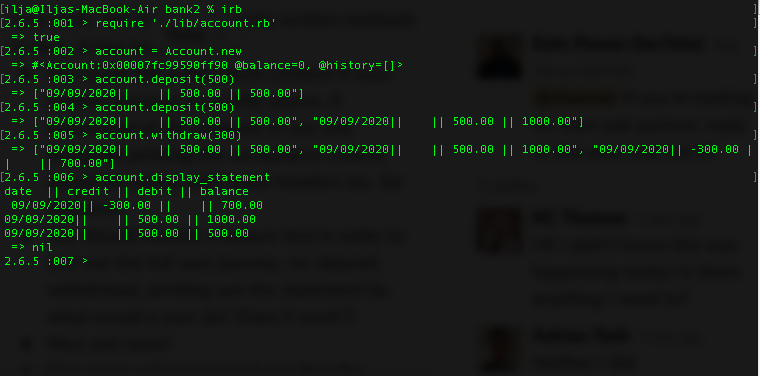

A program that allows deposits or withdrawals from a bank account from command line, and gives a statement for the transactions.

# Setup

To download dependencies, clone this repo and run:

```
bundle install
```

# Run the program

To run the programm in command line, cd to this repo on your computer, run in IRB and create a new account:

```
$ irb
$ require './lib/account.rb'
$ account = Account.new
```
Then use commands 'deposit', 'withdraw' and 'display_statement' as shown below:

```
$ account.deposit(500) ---to make a deposit of £500
$ account.withdraw(300) ---to withdraw £300
$ account.display_statement ---to view your statement
```
See example of use here:


# Run tests

For tests, run:

```
rspec

```
# Acceptance criteria

User should be able to use command line and make deposits, withdrawals and their statement. For example, if they make a deposit of £500 and then on more of £300 and then withdraw £50, they should see:
```
date || credit || debit || balance
09/09/2020 || || 50.00 || 750.00
09/09/2020 || 300.00 || || 800.00
09/09/2020 || 500.00 || || 500.00
```

# Approach

- The code is test-driven. I created tests for deposit and withdraw methods and for statement display method.
- I created two classes: Account for operations and Statement for statement display.
- Methods were included for the date and converting numbers into decimals.
- Further changes may include extraction of Transaction class out of Account, to follow Single Responsibility Principle
